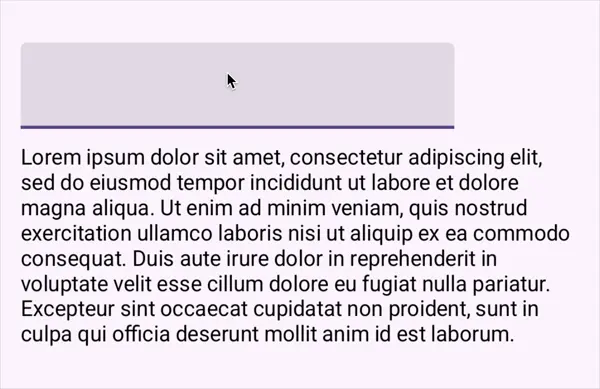
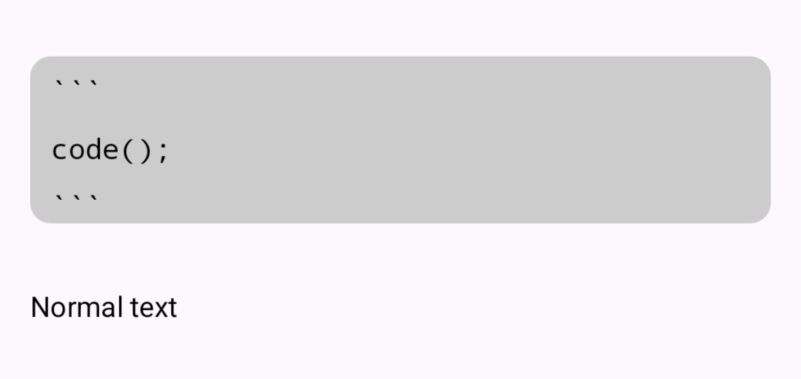

# PatternAnnotatedString

Easily and dynamically style text using patterns/regular expressions in Jetpack Compose.

- [x] 📝 Alternative to `buildAnnotatedString` for dynamic text
- [x] 🎨 Simple, highly flexible Composeable API
- [x] 🚀 Respects Compose lifecycle with performance options
- [x] 📦 Out-of-the-box support for custom paragraph backgrounds
- [x] 🧩 Easily render custom inline content

> _Built to render markdown previews and for highlighting global search results
in [Bundled Notes](https://bundlednotes.com)._

# Basic usage

The library has a very simple API and in most cases you can generate a styled `AnnotatedString` with
just a few lines of code. All you have to do is:

1. Create PatternAnnotation/s that map patterns to text styles:
    ```kotlin
    val italicsMarkdown = basicPatternAnnotation(
        pattern = "_.*?_",
        spanStyle = SpanStyle(fontStyle = FontStyle.Italic),
    )
    ```

2. Use `String.annotatedWith(patternAnnotation/s)` in a Composable to get an AnnotatedString:
    ```kotlin
    val annotatedString = "I love _italic_ text!".annotatedWith(italicsMarkdown)
    ```

3. Use the result in a Composable:
    ```kotlin
    Text(text = annotatedString)
    ```

4. Enjoy the beautiful result:
   

# Advanced usage

PatternAnnotatedString supports some features that `AnnotatedString` does not (out of the box),
including paragraph backgrounds. It also makes it much easier to render custom inline `@Composable`
content. To use these extra, all you need to do is create your custom pattern annotations, and use
`patternAnnotatedString()` instead of `annotatedWith()`, like so:

1. Create PatternAnnotation/s that map patterns to inline content or paragraph styles:
    ```kotlin
    val usernamePill = inlineContentPatternAnnotation(
        pattern = "@[A-Za-z0-9_]+",
        inlineContent = { matchedText ->
            // Return an InlineTextContent composable
        }
    )
    // You can also use paragraphPatternAnnotation() for custom paragraph styles
    ```

2. Use `String.patternAnnotatedString(patternAnnotation/s)` to get a PatternAnnotatedString:
    ```kotlin   
    val result = "Thanks @xavier, this is cool!".patternAnnotatedString(usernamePill)
    ```

3. Use the result, which contains an `annotatedString`, `inlineContentMap` and
   `paragraphBackgroundAnnotations`, to render backgrounds and inline content. See examples further
   below for how to use them!

# Examples

## Basic text styling

You can use `basicPatternAnnotation` and `String.annotatedWith()` to easily add styles to text:

```kotlin
val redFruit = basicPatternAnnotation(
    pattern = "(\\w*berry)|(\\w{0,}apple)",
    spanStyle = SpanStyle(color = Color.Red, fontWeight = FontWeight.Bold)
)

@Composable
fun BasicExample() {
    Text(
        text = "Strawberry Fridge Apple Ferrari".annotatedWith(redFruit)
    )
}
```


> [!NOTE]
> `annotatedWith` is a Composable function and only re-calculates styles if the text or
> annotations/s change.
> Many annotations, long text or complex patterns may impact performance, but the library includes
> options to cater for this - please see the Performance considerations section.

## Search text highlighting (& other dynamic patterns)

You may want to use pattern-based styling when you don't know the pattern at compile-time.
For example, highlighting matching results based on a search query the user inputs.

__This is easy to achieve with this library, but there are some performance considerations:__

1. Create a `PatternAnnotation` with a dynamic pattern inside the Composable, wrapped in a`remember`
   block.
2. Use `String.annotatedWith()` to apply the style/s to a string with the
   `PerformanceStrategy.Performant` option.

```kotlin
@Composable
fun SearchQueryHighlighting() {

    var searchQuery by remember { mutableStateOf("") }

    val highlightMatching = remember(searchQuery) {
        basicPatternAnnotation(
            pattern = searchQuery,
            spanStyle = SpanStyle(background = Color.Yellow)
        )
    }

    val highlightedText = textToHighlight.annotatedWith(
        patternAnnotation = highlightMatching,
        performanceStrategy = PerformanceStrategy.Performant
    )

    TextField(
        value = searchQuery,
        onValueChange = { searchQuery = it }
    )

    Text(highlightedText)
}
```

###### Result:



> [!NOTE]
> Note the two simple methods to avoid too many or slow re-compositions when using dynamic patterns:
> 1. Use `remember` to cache the `PatternAnnotation` with the dynamic pattern. This prevents the
     pattern from having to be instantiated and rebuilt on every recomposition.
> 2. Use the `PerformanceStrategy.Performant` option when calling `annotatedWith`. This will
     mean that text is styled in a background thread, and lead to a *slight* delay in the styles
     being visible.

## Inline content

Compose includes support for inline text content in `buildAnnotatedString` and the `Text`
Composeable, but it can be cumbersome to use - and very difficult with dynamic text.

`String.patternAnnotatedString()` can easily build and return an
`inlineContentMap` that the `Text()` composable can use.

1. Create a `PatternAnnotation` using `inlineContentPatternAnnotation` with an `inlineContent`
   function that returns `InlineTextContent`.
2. Use `String.patternAnnotatedString()` to get a PatternAnnotatedString.
3. Pass the `annotatedString` and `inlineContentMap` to a `Text` composable.

```kotlin
val usernameAnnotation = inlineContentPatternAnnotation(
    pattern = "@[A-Za-z0-9_]+",
    inlineContent = { matchedText ->
        inlineContent(width = 7.3.em, height = 1.8.em) {
            // You can use any composable here, but make sure it fits within the above bounds^
            Pill(usernameToNameMap[matchedText] ?: matchedText)
        }
    }
)

@Composable
fun SimpleInlineExample() {

    val styledComment = "Thanks @xavier, this is cool!".patternAnnotatedString(usernameAnnotation)

    Text(
        text = styledComment.annotatedString,
        inlineContent = styledComment.inlineContentMap
    )
}
```


## Paragraph styling

By default, `AnnotatedString` and `ParagraphStyle`s only support changing the paragraph's text
arrangement/layout properties. `PatternAnnotatedString` includes the ability to draw custom
backgrounds behind paragraphs which be used, for example, to render basic code or quote blocks.

__Steps:__

1. Create a `PatternAnnotation` using `paragraphPatternAnnotation()` with Paragraph styles and/or
   backgrounds.
2. Use `String.getPatternAnnotatedString()` to get a `PatternAnnotatedString` which
   includes background annotations.
3. Call `useParagraphBackgrounds` with the background annotations.
4. Pass the `annotatedString` and `useParagraphBackgrounds` result to a `Text` composable, using the
   `drawParagraphBackgrounds` modifier and the `onTextLayout` parameter.

```kotlin
// This is a more complex pattern annotation, but it's still pretty simple.
// A codeblock paragraph pattern, monospace font and a light grey background.
val codeBlockAnnotation = paragraphPatternAnnotation(
    pattern = "```[^` ][^`]*[^ ]?```",
    spanStyle = SpanStyle(fontFamily = FontFamily.Monospace),
    paragraphStyle = ParagraphStyle(
        // Customise the text alignment, line spacing, etc.
    ),
    onDrawParagraphBackground = { rect ->
        val fullWidthRect = rect.copy(
            right = size.width
        )
        drawRoundRect(
            color = Color.LightGray,
            topLeft = fullWidthRect.topLeft,
            size = fullWidthRect.size,
            cornerRadius = CornerRadius(
                10.dp.toPx(), 10.dp.toPx()
            )
        )
    }
)

@Composable
fun ParagraphStyling() {

    val annotated = multiParagraphText.getPatternAnnotatedString(
        patternAnnotation = codeBlockAnnotation
    )

    val backgroundsResult = useParagraphBackgrounds(
        paragraphBackgroundAnnotations = annotated.paragraphBackgroundAnnotations
    )

    PreviewLayout {
        Text(
            text = annotated.annotatedString,
            onTextLayout = backgroundsResult.onTextLayout,
            modifier = Modifier
                .fillMaxWidth()
                .drawParagraphBackgrounds(backgroundsResult.backgroundsToDraw),
        )
    }

}

```


