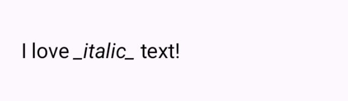
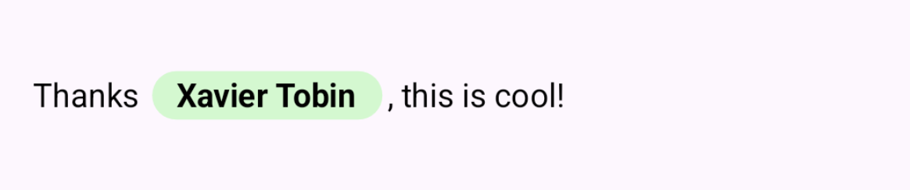
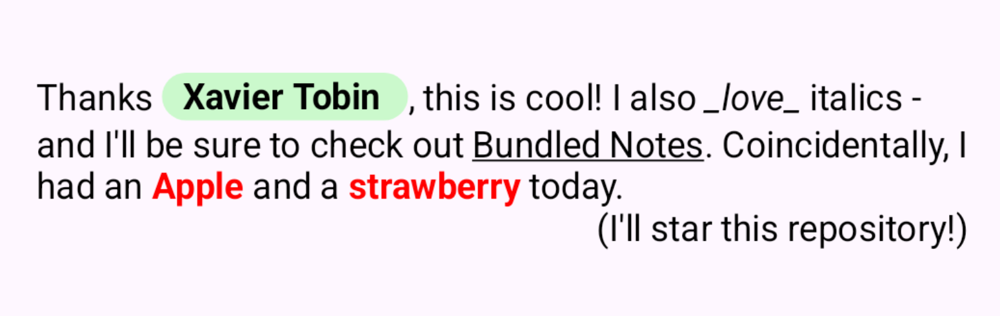

# PatternAnnotatedString

`buildAnnotatedString` is a powerful tool for creating styling text in Jetpack Compose, but it is
designed for styling fixed text, and is unsuitable for styling dynamic or user-generated text.

This library solves this problem by allowing you to create re-usable rules (a.k.a. pattern
annotations) that map a given pattern to text styles, and then use these rules to generate an
`AnnotatedString` from any `String`.

> _Built to render markdown previews and for highlighting global search results
in [Bundled Notes](https://bundlednotes.com)._

----

### Features

- [x] 📝 Flexible alternative to `buildAnnotatedString`
- [x] ⚖️ Extremely lightweight - no third party dependencies
- [x] 🚀 Built to work with Compose lifecycle
- [x] 📎 Easily add clickable links & text
- [x] 📦 Supports custom paragraph backgrounds
- [x] 🧩 Easily render custom inline content
- [x] 📚 Can be used to render markdown

## Readiness checklist

`PatternAnnotatedString` has been an internal experiment for about a month, but I plan to release it
as a
maintained library after I've done the following:

- [ ] Wait until stable compose-bom includes latest StringAnnotation APIs
- [ ] Add more examples to README
- [ ] Add tests
- [ ] Work out how to release library via Maven/Gradle

# Basic usage

The library has a very simple API and in most cases you can generate a styled `AnnotatedString` with
just a few lines of code. All you have to do is:

1. Create a PatternAnnotation, which maps a given pattern to some text styles:
    ```kotlin
    val italicsMarkdown = basicPatternAnnotation(
        pattern = "_.*?_",
        spanStyle = SpanStyle(fontStyle = FontStyle.Italic),
    )
    ```

2. Use `.annotatedWith()` in a Composable - it returns an AnnotatedString with all your styles
   applied:
    ```kotlin
    val annotatedString = "I _love_ italic text!".annotatedWith(italicsMarkdown)
    ```

3. Use the result in any Composable that accepts an `AnnotatedString`:
    ```kotlin
    Text(text = annotatedString)
    ```
   

> [!TIP]
> `pattern` can be any valid regex pattern, or an exact matching string. The above example (
`_.*?_`) matches against italics markdown syntax.

# Advanced usage

For basic text styling, the `AnnotatedString` returned by `annotatedWith()` does the job. However,
`PatternAnnotatedString` supports some features that `AnnotatedString` does not, most notably
paragraph backgrounds and dynamic inline content.

To use these extra features, you can use `richAnnotatedWith()` instead of `annotatedWith()`,
which returns an `AnnotatedString` _and_ the extra data to render paragraph backgrounds and inline
content. See the examples below for more information.

# Examples

### Basic text styling

> Italics, bold, font style, shadow, background etc.

```kotlin
val redFruit = basicPatternAnnotation(
    pattern = "(\\w*berry)|(\\w{0,}apple)",
    spanStyle = SpanStyle(color = Color.Red, fontWeight = FontWeight.Bold)
)

@Composable
fun BasicExample() {
    Text(
        text = "Strawberry Fridge Apple Ferrari".annotatedWith(redFruit)
    )
}
```

###### Result:


> [!IMPORTANT]
> `annotatedWith` is a Composable function and only re-calculates styles if the text or
> annotations/s change.
> Many annotations, long text or complex patterns may impact performance, but the library includes
> options to cater for this - please see the Performance considerations section.

### Links & hyperlinks

> For adding Clickable hyperlinks to text

Use `linkPatternAnnotation()` to create a pattern annotation, and pass a handler that returns the
URL to open. The following example will turn all instances of "Bundled Notes" into a hyperlink to
the website.

```kotlin
val linkAnnotation = linkPatternAnnotation(
    pattern = "Bundled Notes",
    url = "https://bundlednotes.com"
)

@Composable
fun LinksExample() {
    Text(
        text = "Check out the Bundled Notes website!".annotatedWith(linkAnnotation)
    )
}
```

###### Result:


> [!TIP]
> The default SpanStyle for links is `SpanStyle(textDecoration = TextDecoration.Underline)`, but
> just like with any pattern annotation, you can change it!

### Clickable text

> Responding to clicks on text that matches a pattern

Creating a clickable portion of text is just as easy as creating a link or other styles. However,
most of the time you will need to do something with state or context in `onClick`, and therefore
you'll need to create it _in_ your Composable. This is okay, but make sure to use the `remember`
version of the annotation creation function, in this case `rememberClickablePatternAnnotation`, to
avoid re-creating the pattern on every recomposition.

```kotlin
fun BasicClickExample() {
    var clickCount by remember { mutableIntStateOf(0) }

    val clickableAnnotation = rememberClickablePatternAnnotation(
        pattern = ".*",
        onClick = { clickCount++ }
    )

    Text(
        text = "I have been clicked $clickCount times".annotatedWith(clickableAnnotation)
    )
}
```

###### Result:


### Dynamic text styles

> Search text highlighting, find in page etc.

You may want to style text based on a pattern you don't know at compile-time. For example,
highlighting matching text in results from a search query the user inputs. This is _easy_ to
achieve with this library, but there are some important considerations to note.

In this example, we create a pattern annotation to highlight text that matches the user's search
query:

```kotlin


@Composable
fun SearchQueryHighlightedText(val searchQuery: String) {

    val highlightMatching = rememberBasicPatternAnnotation(
        pattern = searchQuery,
        literalPattern = true,
        spanStyle = SpanStyle(background = Color.Yellow)
    )

    val highlightedText = textToHighlight.annotatedWith(
        patternAnnotation = highlightMatching,
        performanceStrategy = PerformanceStrategy.Performant
    )

    Text(highlightedText)
}
```

###### Result:


> [!CAUTION]
> If you are building a pattern annotation based on user input, make sure to set `literalPattern` to
> true - invalid regex will crash the app.

> [!IMPORTANT]
> Note the methods to avoid excessive or slow re-compositions when using dynamic patterns:
> 1. Use `remember` to cache the `PatternAnnotation` with the dynamic pattern. This prevents the
     pattern from having to be instantiated and rebuilt on every recomposition.
> 2. When immediacy is not crucial, use the `PerformanceStrategy.Performant` option when calling
     `annotatedWith()` or `richAnnotatedWith()`. This means that text is styled in a
     background thread and leads to a *slight* delay in the styles becoming visible.

### Inline content

> Custom inline content, like rendering link previews, user pills, hashtags, etc.

Compose includes support for inline text content in `buildAnnotatedString` and the `Text`
Composable, but it can be cumbersome to use - and very difficult with dynamic text.

`String.richAnnotatedWith()` can easily build and return an
`inlineContentMap` that the `Text()` composable can use. See the example below, where @mentions are
rendered as user pills:

```kotlin
val usernameAnnotation = inlineContentPatternAnnotation(
    pattern = "@[A-Za-z0-9_]+",
    inlineContent = { matchedText ->
        inlineTextContent(width = 7.3.em, height = 1.8.em) {
            // You can use any composable here, but make sure it fits within the bounds you choose^
            UsernamePill(matchedText)
        }
    }
)

@Composable
fun SimpleInlineExample() {

    val styledComment = "Thanks @xavier, this is cool!"
        .richAnnotatedWith(usernameAnnotation)

    Text(
        text = styledComment.annotatedString,
        inlineContent = styledComment.inlineContentMap
    )
}
```

###### Result:



> [!TIP]
> If you need to render inline content using, say, data fetched from an API, you can generate your
> pattern annotation in the Composable. Ensure you use `remember` with a key, such as in the
> search highlighting example, to avoid rebuilding the pattern on every recomposition.

### Basic paragraph styling

> Control text layout, line height, alignment

If you don't need to draw custom backgrounds behind paragraphs, paragraph styling is simple. You can
easily align text, change line height, spacing and more using `ParagraphStyle`. In this example, we
create a pattern annotation that right-aligns any text in brackets:

```kotlin
val rightAlignedBrackets = paragraphPatternAnnotation(
    pattern = "\\(.+\\)",
    paragraphStyle = ParagraphStyle(
        textAlign = TextAlign.End
    ),
    // You can also use SpanStyle here! Paragraph and Span styles can be combined.
    // spanStyle = SpanStyle(fontWeight = FontWeight.Bold)
)

@Composable
fun ParagraphAlignmentExample() {
    val annotated = "I am left aligned\n(And I am right aligned)".richAnnotatedWith(
        patternAnnotation = rightAlignedBrackets
    )

    Text(
        text = annotated.annotatedString,
        modifier = Modifier.fillMaxWidth(),
    )
}
```

###### Result:


## Advanced paragraph styling with backgrounds

> Custom backgrounds behind paragraphs, as well as text styling and line height adjustments

It is not possible to draw custom backgrounds with `ParagraphStyle` or `AnnotatedString` out of the
box. To fix this, `PatternAnnotatedString` includes a few helper functions and APIs that make
paragraph backgrounds easy to implement.

__Paragraph background styling steps:__

1. Create a pattern annotation using `paragraphPatternAnnotation()` with your desired paragraph
   styles/pattern.
2. Use `String.richAnnotatedWith()` to get a `PatternAnnotatedString` which includes
   background annotations.
3. Call `rememberParagraphBackgrounds()` and pass the the background annotations.
4. Pass the `annotatedString` and the result of `rememberParagraphBackgrounds` to a `Text`
5. composable, using the `drawParagraphBackgrounds` modifier and the `onTextLayout` parameter.

In this example, we create a pattern annotation that draws a grey background around a block of
code:

```kotlin
val codeBlockAnnotation = paragraphPatternAnnotation(
    pattern = "```[^` ][^`]*[^ ]?```",
    spanStyle = SpanStyle(fontFamily = FontFamily.Monospace),
    paragraphStyle = ParagraphStyle(
        // Customise the text alignment, line spacing, etc.
    ),
    onDrawParagraphBackground = { rect ->
        val fullWidthRect = rect.copy(
            right = size.width
        )
        drawRoundRect(
            color = Color.LightGray,
            topLeft = fullWidthRect.topLeft,
            size = fullWidthRect.size,
            cornerRadius = CornerRadius(
                10.dp.toPx(), 10.dp.toPx()
            )
        )
    }
)

@Composable
fun ParagraphStyling() {

    val annotated = multiParagraphText.richAnnotatedWith(
        patternAnnotation = codeBlockAnnotation
    )

    val backgroundsResult = rememberParagraphBackgrounds(
        paragraphBackgroundAnnotations = annotated.paragraphBackgroundAnnotations
    )

    Text(
        text = annotated.annotatedString,
        onTextLayout = backgroundsResult.onTextLayout,
        modifier = Modifier
            .fillMaxWidth()
            .drawParagraphBackgrounds(backgroundsResult.backgroundsToDraw),
    )

}

```

###### Result:


> [!WARNING]
> There are a few things to keep in mind when styling paragraphs with this library:
> 1. Overlapping paragraphs will cause a crash! Ensure that your patterns are mutually exclusive.
> 2. Backgrounds are drawn on the main thread, so keep them simple.
> 3. Backgrounds only appear on the second re-composition, so keep this in mind when designing your
     UI.

### Multiple/combined annotations

You are not limited to one pattern annotation (or type of pattern annotation) when styling a
string - both `annotatedWith()` and `richAnnotatedWith()` can take a list of annotations.

This makes it easy to create rich, custom text styles in only a few lines of code. Here, we combine
several of the above examples:

```kotlin
@Composable
fun CombinedExample() {

    val userComment = "Thanks @xavier, this is cool! " +
            "I also _love_ italics - and I'll be sure to check out Bundled Notes. " +
            "Coincidentally, I had an Apple and a strawberry today." +
            "(I'll star this repository!)"

    val styledComment = userComment.richAnnotatedWith(
        patternAnnotations = listOf(
            usernameAnnotation,
            italics,
            redFruit,
            linkAnnotation,
            rightAlignedAnnotation
        )
    )

    Text(
        text = styledComment.annotatedString,
        inlineContent = styledComment.inlineContentMap
    )

}
```

###### Result:



# How does it work?

`PatternAnnotation` is a simple data class which holds pattern and styles/handlers. The builder
classes, like `basicPatternAnnotation()` and `linkPatternAnnotation()`, make creating a pattern
annotation easy, with sensible defaults.

The logic for generating an `AnnotatedString` is quite simple. You can see
it [here](app/src/main/java/com/xaviertobin/patternannotatedstring/CalculatePatternAnnotatedString.kt) -
it is ~100 lines. But, TL;DR:

1. When you call `annotatedWith()` or `richAnnotatedWith()`, the library goes through each pattern
   and generates a list of `AnnotatedString.Range` objects with the styles/handlers applied, like
   so: `rangedAnnotations.add(AnnotatedString.Range(style, start, end))`. It also tracks a list of
   discovered inline content and paragraph backgrounds.

2. After all patterns are processed and the list of `AnnotatedString.Range`s is ready, the library
   builds an annotated string like so:
   `AnnotatedString(text = text, annotations = rangedAnnotations)`.

3. That's it! The `AnnotatedString` is returned, along with any inline content and paragraph
   backgrounds if you use `richAnnotatedWith()`.

The rest of the library is comprised of:
1. Composable functions for creating pattern annotations and applying them to text.
2. Helper functions to make creating pattern annotations easier, e.g. `basicPatternAnnotation()`.
3. Helper functions to make rendering paragraph backgrounds easier, e.g. `rememberParagraphBackgrounds()`.


# More to come

- Performance notes
- API documentation
- Tips and tricks